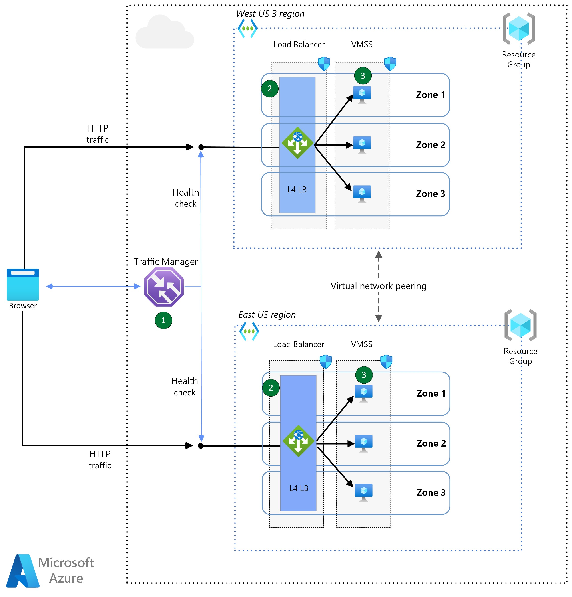

# Day 2 and 3 Implementation - Azure CLI Guide

## Deployment guide of an Azure Virtual Machine Scale Set in a multi-region environment

The purpose of this guide is to implement a resilience and high available environment for your applications using Virtual Machine Scale Sets (VMSS). In this guide the VMSS will be deployed in a multizone and multiregion environment. With this configuration, your applications will be tolerant to single VM, datacenter and region failures, with an automatic failover due to the use of Regional Load Balancer solutions (Azure Traffic Manager).

### Reference architecture



## Prerequisites

* An Azure account with sufficient permissions to create resources

<https://learn.microsoft.com/en-us/dotnet/azure/create-azure-account>

## List of Azure Resources

The following resources will be deployed as part of this guide. All the steps to create the resources will be specified, but you may reuse existing services.

* Resource Group
* VNET
* Virtual Network (VNET)
* Network Security Group (NSG)
* Load Balancer
* Traffic Manager
* Virtual Machine Scale Set
* Azure Monitor
* Log Analytics

## Step by Step guide to deploy a multi-region VMSS

### Log and authenticate to the Azure Portal

<https://portal.azure.com/>

### Open the Cloud Shell icon

* In the Azure Portal, click the top-right icon named "Cloud Shell"
  * Inside the Cloud Shell, in the top-left icon select "Bash"
or
* Open a new browser tab and go to the following website:

<https://shell.azure.com>

* Paste the following commands in the Azure Cloud Shell
  * Inside the Cloud Shell, in the top-left icon select "Bash"

_[Copy & Paste instructions for Azure Cloud Shell](https://learn.microsoft.com/en-us/azure/cloud-shell/using-the-shell-window#copy-and-paste)_

### Define the following variables

```text
let "randomString=$RANDOM*$RANDOM"
regionPrimary="eastus"
regionSecondary="westus3"
resourceGroupPrimary="rgpri$randomString"
resourceGroupSecondary="rgsec$randomString"
vnetPrimary="vnetpri$randomString"
vnetSecondary="vnetsec$randomString"
subnetCIDRPrimary="10.0.0.0/16"
subnetCIDRSecondary="10.1.0.0/16"
subnetPrefixPrimary="10.0.0.0/24"
subnetPrefixSecondary="10.1.0.0/24"
subnetNamePrimary="subnet1"
subnetNameSecondary="subnet1"
nsgPrimary="nsgpri$randomString"
nsgSecondary="nsgsec$randomString"
pipLbPrimary="pipvmsspri$randomString"
pipLbSecondary="pipvmsssec$randomString"
loadBalancerPrimary="lbpri$randomString"
loadBalancerSecondary="lbsec$randomString"
lbFrontendIp="lbFrontEnd"
lbHealthProbe="vmss-HealthProbe"
trafficManager="tf$randomString"
vmssPrimary="vmsspri$randomString"
vmssSecondary="vmsssec$randomString"
logAnalyticsWorkspace="la$randomString"
adminUsername="adminuser"
adminPassword="Password-$randomString"
echo randomString: $randomString
```

### Create Primary and Secondary Resource Group

```text
az group create --name $resourceGroupPrimary --location $regionPrimary
az group create --name $resourceGroupSecondary --location $regionSecondary
```

### Create Primary and Secondary VNET

```text
az network vnet create --name $vnetPrimary --resource-group $resourceGroupPrimary --address-prefix $subnetCIDRPrimary --subnet-name $subnetNamePrimary --subnet-prefixes $subnetPrefixPrimary
az network vnet create --name $vnetSecondary --resource-group $resourceGroupSecondary --address-prefix $subnetCIDRSecondary --subnet-name $subnetNameSecondary --subnet-prefixes $subnetPrefixSecondary
```

### Peer virtual networks (VNET Peering)

#### Get the resource id's of the Primary and Secondary VNETs

```text
vnetPrimaryId=$(az network vnet show --resource-group $resourceGroupPrimary --name $vnetPrimary --query id --out tsv)
vnetSecondaryId=$(az network vnet show --resource-group $resourceGroupSecondary --name $vnetSecondary --query id --out tsv)
```

#### Create a VNET Peering from vnetPrimary to vnetSecondary

```text
az network vnet peering create --name vnetPrimary-vnetSecondary --resource-group $resourceGroupPrimary --vnet-name $vnetPrimary --remote-vnet $vnetSecondaryId --allow-vnet-access
```

#### Create a VNET Peering from vnetSecondary to vnetPrimary

```text
az network vnet peering create --name vnetSecondary-vnetPrimary --resource-group $resourceGroupSecondary --vnet-name $vnetSecondary --remote-vnet $vnetPrimaryId --allow-vnet-access
```

### Create the Primary and Secondary NSGs

```text
az network nsg create --resource-group $resourceGroupPrimary --name $nsgPrimary
az network nsg create --resource-group $resourceGroupSecondary --name $nsgSecondary
```

### Associate a NSGs to the Primary and Secondary subnets

```text
az network vnet subnet update --resource-group $resourceGroupPrimary --vnet-name $vnetPrimary --name $subnetNamePrimary --network-security-group $nsgPrimary
az network vnet subnet update --resource-group $resourceGroupSecondary --vnet-name $vnetSecondary --name $subnetNameSecondary --network-security-group $nsgSecondary
```

### Create NSG security rules to allow inbound HTTP traffic

```text
az network nsg rule create --resource-group $resourceGroupPrimary --nsg-name $nsgPrimary --name HTTP-rule --priority 300 --destination-address-prefixes '*' --destination-port-ranges 80 --protocol Tcp --description "Allow HTTP"
az network nsg rule create --resource-group $resourceGroupSecondary --nsg-name $nsgSecondary --name HTTP-rule --priority 300 --destination-address-prefixes '*' --destination-port-ranges 80 --protocol Tcp --description "Allow HTTP"
```

### Create the Load Balancers

#### Create a public IP addresses for the Primary and Secondary Load Balancers

```text
az network public-ip create --resource-group $resourceGroupPrimary --name $pipLbPrimary --dns-name $pipLbPrimary --sku Standard --zone 1 2 3
az network public-ip create --resource-group $resourceGroupSecondary --name $pipLbSecondary  --dns-name $pipLbSecondary  --sku Standard --zone 1 2 3
```

#### Create the Primary and Secondary Load Balancers

```text
az network lb create --resource-group $resourceGroupPrimary --name $loadBalancerPrimary --sku Standard --public-ip-address $pipLbPrimary --frontend-ip-name $lbFrontendIp
az network lb create --resource-group $resourceGroupSecondary --name $loadBalancerSecondary --sku Standard --public-ip-address $pipLbSecondary --frontend-ip-name $lbFrontendIp
```

#### Create the VMSS health probe on port 80

```text
az network lb probe create --resource-group $resourceGroupPrimary --lb-name $loadBalancerPrimary --name $lbHealthProbe --protocol tcp --port 80 --interval-in-seconds 360 --number-of-probes 5
az network lb probe create --resource-group $resourceGroupSecondary --lb-name $loadBalancerSecondary --name $lbHealthProbe --protocol tcp --port 80 --interval-in-seconds 360 --number-of-probes 5
```

### Create the Virtual Machine Scale Sets (VMSS)

#### Create the primary VMSS

```text
az vmss create \
  --resource-group $resourceGroupPrimary \
  --name $vmssPrimary \
  --image MicrosoftWindowsServer:WindowsServer:2022-Datacenter:latest \
  --location $regionPrimary \
  --authentication-type password \
  --admin-username $adminUsername \
  --admin-password $adminPassword \
  --computer-name-prefix "vmss" \
  --instance-count 3 \
  --os-disk-caching ReadWrite \
  --vnet-name $vnetPrimary \
  --subnet $subnetNamePrimary \
  --upgrade-policy-mode automatic \
  --vm-sku Standard_D2s_v5 \
  --zones 1 2 3 \
  --lb $loadBalancerPrimary   
```

#### Create the secondary VMSS

```text
az vmss create \
  --resource-group $resourceGroupSecondary \
  --name $vmssSecondary \
  --image MicrosoftWindowsServer:WindowsServer:2022-Datacenter:latest \
  --location $regionSecondary \
  --authentication-type password \
  --admin-username $adminUsername \
  --admin-password $adminPassword \
  --computer-name-prefix "vmss" \
  --instance-count 3 \
  --os-disk-caching ReadWrite \
  --vnet-name $vnetSecondary \
  --subnet $subnetNameSecondary \
  --upgrade-policy-mode automatic \
  --vm-sku Standard_D2s_v5 \
  --zones 1 2 3 \
  --lb $loadBalancerSecondary
```

### Create the Load Balancers rules

#### Get the Primary and Secondary Load Balancers Backend Pool names

```text
lbBackendPoolPrimary=$(az network lb show --resource-group $resourceGroupPrimary --name $loadBalancerPrimary --query backendAddressPools[].name --out tsv)
lbBackendPoolSecondary=$(az network lb show --resource-group $resourceGroupSecondary --name $loadBalancerSecondary --query backendAddressPools[].name --out tsv)
```

#### Create the Primary Load Balancer rule

```text
az network lb rule create \
    --resource-group $resourceGroupPrimary \
    --lb-name $loadBalancerPrimary \
    --name vmssHTTPRule \
    --protocol tcp \
    --frontend-port 80 \
    --backend-port 80 \
    --frontend-ip-name $lbFrontendIp \
    --backend-pool-name $lbBackendPoolPrimary \
    --probe-name $lbHealthProbe \
    --idle-timeout-in-minutes 15 
```

#### Create the  Primary and Secondary Load Balancer rule

```text
az network lb rule create \
    --resource-group $resourceGroupSecondary \
    --lb-name $loadBalancerSecondary \
    --name vmssHTTPRule \
    --protocol tcp \
    --frontend-port 80 \
    --backend-port 80 \
    --frontend-ip-name $lbFrontendIp \
    --backend-pool-name $lbBackendPoolSecondary \
    --probe-name $lbHealthProbe \
    --idle-timeout-in-minutes 15 
```

### Create and configure the Traffic Manager

#### Create the Traffic Manager Profile

```text
az network traffic-manager profile create \
    --name $trafficManager \
    --resource-group $resourceGroupPrimary \
    --routing-method Priority \
    --path '/' \
    --protocol "HTTP" \
    --unique-dns-name $trafficManager  \
    --ttl 30 \
    --port 80
```

#### Get the Resource Id of the Primary and Secondary Load Balancer Public IP

```text
pipLbPrimaryId=$(az network public-ip show --resource-group $resourceGroupPrimary --name $pipLbPrimary --query id --out tsv)
pipLbSecondaryId=$(az network public-ip show --resource-group $resourceGroupSecondary --name $pipLbSecondary --query id --out tsv)
```

#### Create the Primary Endpoint (Primary Load Balancer)

```text
az network traffic-manager endpoint create \
    --name $loadBalancerPrimary \
    --resource-group $resourceGroupPrimary \
    --profile-name $trafficManager \
    --type azureEndpoints \
    --target-resource-id $pipLbPrimaryId \
    --priority 1 \
    --endpoint-status Enabled
```

#### Create the Secondary Endpoint (Secondary Load Balancer)

```text
az network traffic-manager endpoint create \
    --name $loadBalancerSecondary \
    --resource-group $resourceGroupPrimary \
    --profile-name $trafficManager \
    --type azureEndpoints \
    --target-resource-id $pipLbSecondaryId \
    --priority 2 \
    --endpoint-status Enabled
```
