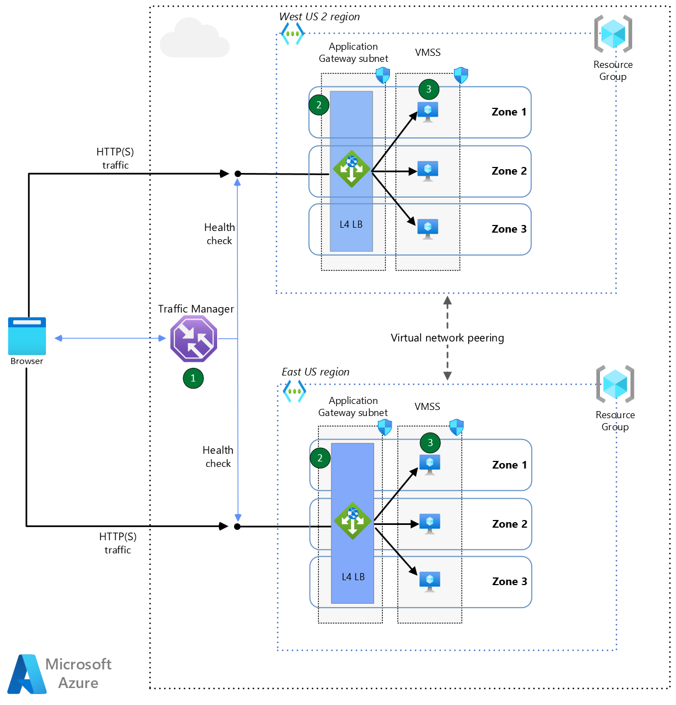

# Day 2 and 3 Implementation

## Deployment guide of an Azure Virtual Machine Scale Set in a multi-region environment

_ADD-DESCRIPTION-OF-THE-GUIDE_

### Reference architecture



## Prerequisites

* An Azure account with sufficient permissions to create resources

<https://learn.microsoft.com/en-us/dotnet/azure/create-azure-account>

## List of Azure Resources

The following resources will be deployed as part of this guide. All the steps to create the resources will be specified, but you may reuse existing services.

* Resource Group
* VNET
* Virtual Network (VNET)
* Network Security Group (NSG)
* Load Balancer
* Traffic Manager
* Virtual Machine Scale Set
* Azure Monitor
* Log Analytics

## Step by Step guide to deploy a multi-region VMSS

### Log and authenticate to the Azure Portal

<https://portal.azure.com/>

### Open the Cloud Shell icon

* In the Azure Portal, click the top-right icon named "Cloud Shell" 
or
* Open a new browser tab and go to the following website:

<https://shell.azure.com>

* Paste the following commands in the Azure Cloud Shell

_[Copy & Paste instructions for Azure Cloud Shell](https://learn.microsoft.com/en-us/azure/cloud-shell/using-the-shell-window#copy-and-paste)_

### Define the following variables

```text
let "randomString=$RANDOM*$RANDOM"
regionPrimary="eastus"
regionSecondary="westus"
resourceGroupPrimary="rgpri$randomString"
resourceGroupSecondary="rgsec$randomString"
vnetPrimary="vnetpri$randomString"
vnetSecondary="vnetsec$randomString"
subnetCIDRPrimary="10.0.0.0/16"
subnetCIDRSecondary="10.1.0.0/16"
subnetPrefixPrimary="10.0.0.0/24"
subnetPrefixSecondary="10.1.0.0/24"
subnetNamePrimary="subnet1"
subnetNameSecondary="subnet1"
nsgPrimary="nsgpri$randomString"
nsgSecondary="nsgsec$randomString"
loadBalancerPrimary="lbpri$randomString"
loadBalancerSecondary="lbsec$randomString"
trafficManager="tf$randomString"
vmssPrimary="vmsspri$randomString"
vmssSecondary="vmsssec$randomString"
logAnalyticsWorkspace="la$randomString"
adminUsername="adminuser"
adminPassword="pwd$randomString"
echo randomString: $randomString
```

### Create Primary and Secondary Resource Group

```text
az group create --name $resourceGroupPrimary --location $regionPrimary
az group create --name $resourceGroupSecondary --location $regionSecondary
```

### Create Primary and Secondary VNET

```text
az network vnet create --name $vnetPrimary --resource-group $resourceGroupPrimary --address-prefix $subnetPrimary --subnet-name $subnetNamePrimary --subnet-prefixes $subnetPrefixPrimary
az network vnet create --name $vnetSecondary --resource-group $resourceGroupSecondary --address-prefix $subnetSecondary --subnet-name $subnetNameSecondary --subnet-prefixes $subnetPrefixSecondary
```

### Peer virtual networks (VNET Peering)

#### Get the resource id's of the VNETs

```text
vnetPrimaryId=$(az network vnet show --resource-group $resourceGroupPrimary --name $vnetPrimary --query id --out tsv)
vnetSecondaryId=$(az network vnet show --resource-group $resourceGroupSecondary --name $vnetSecondary --query id --out tsv)
```

#### Create a peering from vnetPrimary to vnetSecondary

```text
az network vnet peering create --name vnetPrimary-vnetSecondary --resource-group $resourceGroupPrimary --vnet-name $vnetPrimary --remote-vnet $vnetSecondaryId --allow-vnet-access
```

#### Create a peering from vnetSecondary to vnetPrimary

```text
az network vnet peering create --name vnetSecondary-vnetPrimary --resource-group $resourceGroupSecondary --vnet-name $vnetSecondary --remote-vnet $vnetPrimaryId --allow-vnet-access
```

### Create the NSGs

```text
az network nsg create --resource-group $resourceGroupPrimary --name $nsgPrimary
az network nsg create --resource-group $resourceGroupSecondary --name $nsgSecondary
```

### Associate a NSG to the Primary and Secondary subnets

```text
az network vnet subnet update --resource-group $resourceGroupPrimary --vnet-name $vnetPrimary --name $subnetNamePrimary --network-security-group $nsgPrimary
az network vnet subnet update --resource-group $resourceGroupSecondary --vnet-name $vnetSecondary --name $subnetNameSecondary --network-security-group $nsgSecondary
```

### Create a security rule

```text
az network nsg rule create --resource-group $resourceGroupPrimary --nsg-name $nsgPrimary --name HTTPS-rule --priority 300 --destination-address-prefixes '*' --destination-port-ranges 443 --protocol Tcp --description "Allow SSH"

az network nsg rule create --resource-group $resourceGroupSecondary --nsg-name $nsgSecondary --name HTTPS-rule --priority 300 --destination-address-prefixes '*' --destination-port-ranges 443 --protocol Tcp --description "Allow SSH"
```

### NEXT CREATE A VM

```text

az vmss create \
  --resource-group $resourceGroupPrimary \
  --name $vmssPrimary \
  --image "MicrosoftWindowsServer:WindowsServer:2022-Datacenter:latest" \
  --location $regionPrimary \   
  --admin-username $adminUsername \
  --admin-password $adminPassword \
  --computer-name-prefix "vmss"
  --instance-count 3 \
  --os-disk-caching "ReadWrite" \  
  --platform-fault-domain-count 1 \
  --vnet-name $vnetPrimary \
  --subnet $subnetNamePrimary \
  --upgrade-policy-mode "automatic" \
  --vm-sku "Standard_D2s_v5" \
  --zones 1 2 3

```